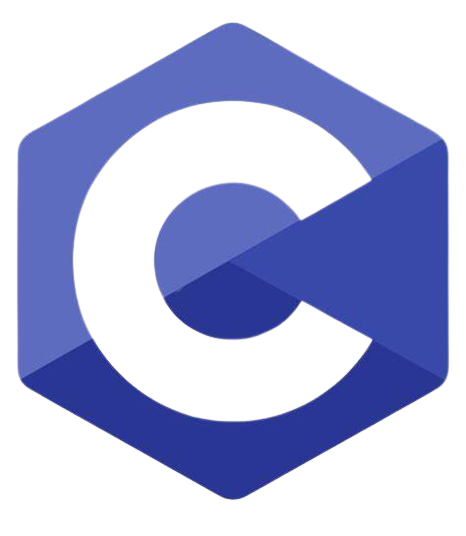
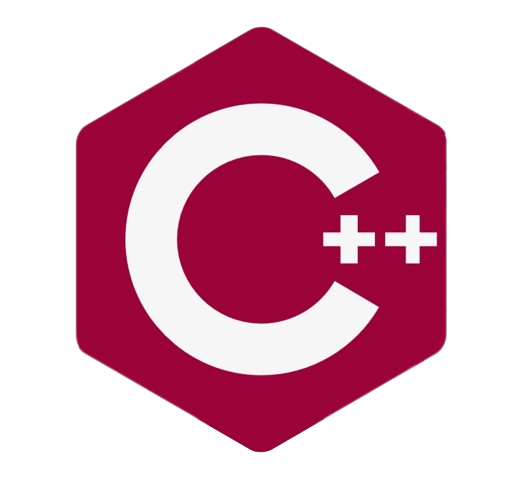
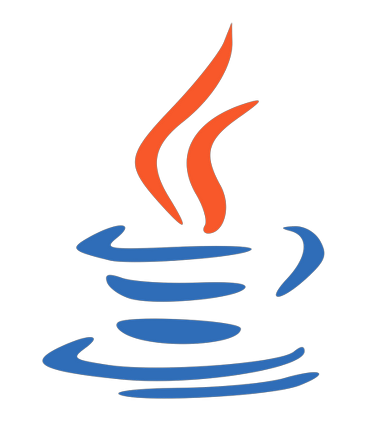
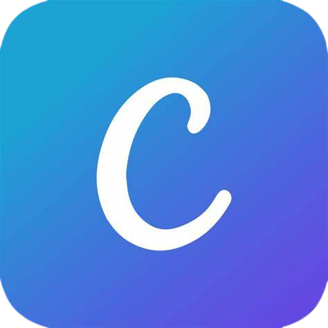

## Hi, I'm Saba 👋

<!--
**sabasarwar/sabasarwar** is a ✨ _special_ ✨ repository because its `README.md` (this file) appears on your GitHub profile.

Here are some ideas to get you started:

- 🔭 I’m currently working on ...
- 🌱 I’m currently learning ...
- 👯 I’m looking to collaborate on ...
- 🤔 I’m looking for help with ...
- 💬 Ask me about ...
- 📫 How to reach me: ...
- 😄 Pronouns: ...
- ⚡ Fun fact: ...
-->

  👀 I am an Artificial Intelligence, Machine Learning, and Deep Learning enthusiast 
  🤖 Currently working on Image Processing and its application in Healthcare 
  🫂 Looking for a collaborator on ML/DL and Image Processing projects  
  📫 sabasarwar1997@gmail.com   
  <!-- 🕸️ <a href = "https://sabasarwar.github.io/">My Portfolio</a> -->
  

 
 
 

  
  
  
  

 

## 👩‍💻 Tech Stack

<h3>Languages and Tools: 
 
 

    
    
    
    
    
    
     
    
    
    
    
    
    

 

<h3>Python libraries: 
 
 

 
 